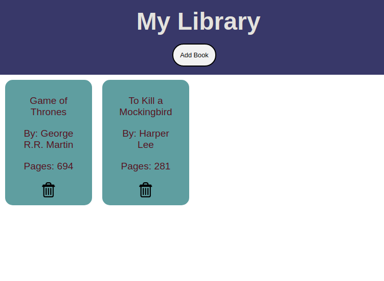

# My library
 My library application lets the user store books with the title name, 
 author and pages. All the stored books are displayed on the application with
 the book details and a delete button with it, in case user wants to remove any books. 
 NOTE: The application is not provided with any type of storage.
 
  
